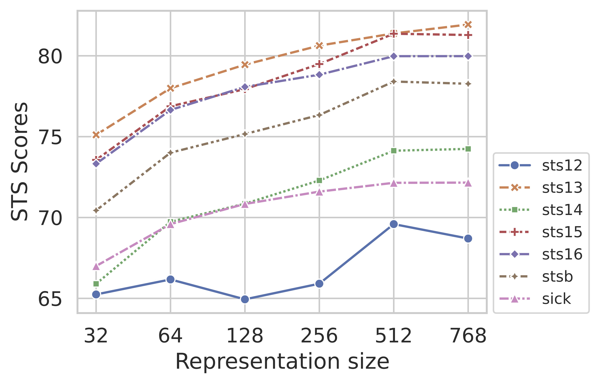
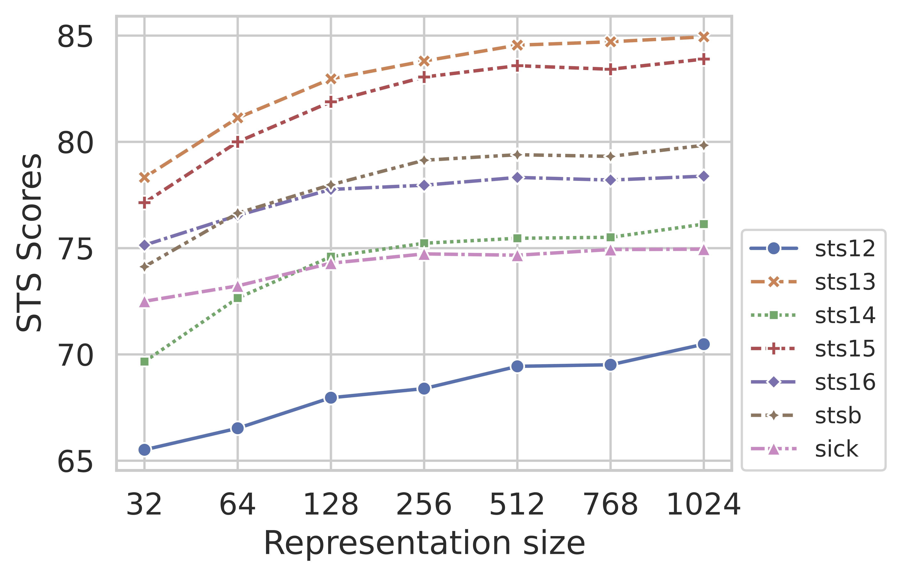

# SimCSE-Matryoshka: A mixture of SimCSE and Matryoshka Representation Learning 


## Introduction

SimCSE-Matryoshka is an innovative unsupervised learning method that aims to obtain multi-dimensional sentence representations by combining the strengths of [SimCSE (Simple Contrastive Learning of Sentence Embeddings)](https://aclanthology.org/2021.emnlp-main.552/) and [Matryoshka Representation Learning](https://proceedings.neurips.cc/paper_files/paper/2022/file/c32319f4868da7613d78af9993100e42-Paper-Conference.pdf).

SimCSE, introduced by Gao et al. (2021), has revolutionized sentence representation learning by leveraging contrastive learning to capture semantic similarities between sentences without the need for labeled data. Its simplicity and effectiveness have made it a popular choice in the field.

Building upon SimCSE, we incorporate Matryoshka Representation Learning to learn a hierarchy of sentence representations at different granularities, much like the nested dolls of a Matryoshka. By simultaneously learning multiple dimensions of sentence representations, SimCSE-Matryoshka aims to extract rich semantic information from limited training resources. Each nesting representation captures semantic abstraction at different dimension, enabling a more efficient and comprehensive understanding of sentences.

We used a simpler version of [SimCSE(Simple-SimCSE)](https://github.com/hppRC/simple-simcse) as base code out of simplicity.

## Getting Started

Pip install the requirements file in this directory. Note that a python3 distribution is required:

```bash
pip3 install -r requirements.txt
```

### Preparing the Dataset

Execute `download.sh` to download training and evaluation datasets beforehand.
`download.sh` will collect STS and training datasets used in the paper in parallel.

```bash
bash download.sh
```

## Matryoshka Sentence Embedding

We have made minor modifications to the SimCSE model. In our implementation, we use the CLS token embedding, which is the best sentence representation method mentioned in the original paper, as the Matryoshka representation.

Inspired by subsequent contrastive learning works, the original SimCSE implementation introduces an additional projection layer, and the contrastive loss is computed using the output of this projection instead of the CLS embedding itself. This approach slightly improves the model's performance, and the specific reasons have been explained in [SimCLRv2](https://proceedings.mlr.press/v119/chen20j/chen20j.pdf) and [BYOL](https://papers.nips.cc/paper/2020/file/f3ada80d5c4ee70142b17b8192b2958e-Paper.pdf).

In this repository, we [directly replace the projection layer with a Matryoshka linear layer](https://github.com/bocabolala/SimCSE-Matryoshka/blob/main/train.py#L151-L158), which does not increase the inference overhead. By doing so, we aim to leverage the benefits of Matryoshka Representation Learning while maintaining the simplicity and efficiency of the SimCSE framework.

## Training SimCSE

### BERT-based model

To start training BERT-based SimCSE, simply run the command:

```bash
python train.py --model bert-base-uncased \
--epochs 1 \
--lr 3e-5 \
--batch_size 64 \
--temp 0.05 \
--output_dir result/my-unsup-simcse-bert-base-uncased \
--eval_logging_interval 250 \
--minimal_dim 32 \
--efficient_matryoshka
```

### RoBERTa-bsed model

To start training RoBERTa-bsed SimCSE, simply run the command:

```bash
python train.py --model roberta-base \
--epochs 1 \
--lr 3e-5 \
--batch_size 64 \
--temp 0.05 \
--output_dir result/my-unsup-simcse-roberta-base \
--eval_logging_interval 250 \
--minimal_dim 32 \
--efficient_matryoshka
```

## Experiments

### STS Performance of SimCSE at different Matryoshka Representation dimensions

#### BERT-base model



#### BERT-large model



The experimental results demonstrate that by employing the Matryoshka representation learning approach, the performance can be maintained while significantly reducing the dimensionality of sentence embeddings.

## References

+ [princeton-nlp/SimCSE](https://github.com/princeton-nlp/SimCSE)
+ [hppRC/simple-simcse](https://github.com/hppRC/simple-simcse)
+ [RAIVNLab/MRL](https://github.com/RAIVNLab/MRL)
